# n8n MCP Server Integration Setup

## Overview
The application now uses an n8n MCP (Model Context Protocol) Server to execute database queries for products, pricing, and price multipliers.

---

## ✅ Completed Changes

### 1. Tool Definitions Updated
**File:** `src/lib/toolDefinitions.ts`

**Three tools now available:**
- `get_products` - Search products by product code
- `get_prices` - Get pricing by product ID
- `get_multiplier` - Get latest price multiplier

**n8n endpoint:** `https://n8n.traidenis.org/mcp/9396f434-1906-495e-abdb-b853736682b1`

### 2. Tool Executors Updated
**File:** `src/lib/toolExecutors.ts`

All tool calls now route through `callN8nMCPServer()` which:
- POSTs to n8n MCP endpoint
- Sends `{ tool: toolName, input: toolInput }`
- Returns JSON results from n8n

---

## 📋 Required Setup Steps

### Step 1: Add Google Sheets URL to Database

The Google Sheets URL needs to be user-configurable via the `instruction_variables` table.

**Run this SQL in pgAdmin or psql:**

```sql
INSERT INTO instruction_variables (
  variable_key,
  variable_name,
  content,
  display_order
) VALUES (
  'google_sheets_url',
  'Google Sheets Product Catalog URL',
  'https://docs.google.com/spreadsheets/d/1O0bZoZH09LXuxwOczFlpOvsFeiYd12YTCdRNzOVrwpY/edit?usp=sharing',
  100
);
```

**This will:**
- Create a new row in `instruction_variables` table
- Make it editable in the "Instrukcijos" tab
- Allow users to change the Google Sheets URL without code changes

**The variable `{google_sheets_url}` can then be used in the system prompt template.**

---

### Step 2: Update System Prompt

Update the system prompt in `prompt_template` table to reference the Google Sheets URL:

```markdown
## PRODUCT CATALOG

The product catalog is maintained in a Google Sheet at:
{google_sheets_url}

This sheet contains:
- Component codes
- Capacity specifications (nasumas)
- Depth specifications (gylis/igilinimas)
- Available system configurations

You can reference this URL when explaining product options to users.
```

---

### Step 3: Verify n8n MCP Workflow

**Test the n8n endpoint:**

```bash
# Test get_products
curl -X POST https://n8n.traidenis.org/mcp/9396f434-1906-495e-abdb-b853736682b1 \
  -H "Content-Type: application/json" \
  -d '{
    "tool": "get_products",
    "input": {
      "product_code": "HNVN13.18.0"
    }
  }'

# Test get_prices
curl -X POST https://n8n.traidenis.org/mcp/9396f434-1906-495e-abdb-b853736682b1 \
  -H "Content-Type: application/json" \
  -d '{
    "tool": "get_prices",
    "input": {
      "id": 123
    }
  }'

# Test get_multiplier
curl -X POST https://n8n.traidenis.org/mcp/9396f434-1906-495e-abdb-b853736682b1 \
  -H "Content-Type: application/json" \
  -d '{
    "tool": "get_multiplier",
    "input": {}
  }'
```

**Expected response format:**
```json
{
  "success": true,
  "data": [ ... ]
}
```

---

### Step 4: Test in Application

1. **Reload the application**
2. **Send a test message:** "What is the price for product HNVN13.18.0?"
3. **Check console logs:**
   - `[n8n MCP] Calling tool: get_products`
   - `[n8n MCP] Response status: 200 OK`
   - `[n8n MCP] Tool get_products result: {...}`

---

## 🔄 Tool Execution Flow

```mermaid
sequenceDiagram
    User->>Claude: "What's the price for HNVN13.18.0?"
    Claude->>SDKInterface: Use get_products tool
    SDKInterface->>n8n MCP: POST /mcp/{id} (tool: get_products)
    n8n MCP->>MySQL: SELECT * FROM products WHERE code=?
    MySQL-->>n8n MCP: Product data (id: 123)
    n8n MCP-->>SDKInterface: JSON result
    SDKInterface-->>Claude: tool_result content
    Claude->>SDKInterface: Use get_prices tool (id: 123)
    SDKInterface->>n8n MCP: POST /mcp/{id} (tool: get_prices)
    n8n MCP->>MySQL: SELECT * FROM pricing WHERE product_id=?
    MySQL-->>n8n MCP: Price data
    n8n MCP-->>SDKInterface: JSON result
    SDKInterface-->>Claude: tool_result content
    Claude-->>User: "The price for HNVN13.18.0 is €5,500"
```



---

## 🎯 Tool Usage Examples

### Example 1: Get Product Details
```typescript
// Claude uses:
{
  "name": "get_products",
  "input": {
    "product_code": "HNVN13.18.0"
  }
}

// n8n returns:
{
  "success": true,
  "data": [{
    "id": 123,
    "product_code": "HNVN13.18.0",
    "product_name": "System 13 PE 18m",
    "category": "Standard"
  }]
}
```

### Example 2: Get Pricing
```typescript
// Claude uses (after getting id from get_products):
{
  "name": "get_prices",
  "input": {
    "id": 123
  }
}

// n8n returns:
{
  "success": true,
  "data": [{
    "product_id": 123,
    "price": 5500.00,
    "currency": "EUR",
    "created": "2025-01-15T10:00:00Z"
  }]
}
```

### Example 3: Get Price Multiplier
```typescript
// Claude uses:
{
  "name": "get_multiplier",
  "input": {}
}

// n8n returns:
{
  "success": true,
  "data": [{
    "multiplier": 1.2000,
    "description": "Standard 20% markup",
    "created": "2025-01-01T00:00:00Z"
  }]
}
```

---

## 🐛 Troubleshooting

### Issue: n8n returns 404
**Cause:** MCP workflow not deployed or URL incorrect
**Fix:** Verify n8n workflow is active and URL matches

### Issue: n8n returns 500
**Cause:** MySQL connection error or query failure
**Fix:** Check n8n workflow execution logs for database errors

### Issue: Tool returns empty data
**Cause:** No matching records in database
**Fix:** Verify product codes and IDs exist in MySQL tables

### Issue: CORS errors
**Cause:** n8n not configured to accept browser requests
**Fix:** Configure CORS headers in n8n MCP Server Trigger node

---

## 🔮 Future Enhancements

### Option 1: Add Google Sheets Tool to n8n
If you want to add a 4th tool for Google Sheets:

1. **Add MCP Server tool in n8n workflow:**
   - Tool name: `get_google_sheet`
   - Input: `{ url: string }`
   - Action: Fetch CSV from Google Sheets, parse to JSON

2. **Update toolDefinitions.ts:**
```typescript
{
  name: 'get_google_sheet',
  description: 'Fetches product catalog from Google Sheets',
  input_schema: {
    type: 'object',
    properties: {
      url: {
        type: 'string',
        description: 'Google Sheets URL (from {google_sheets_url} variable)'
      }
    },
    required: ['url']
  }
}
```

### Option 2: Add Commercial Offer Generation Tool
For the Google Doc generation feature (coming soon):

```typescript
{
  name: 'generate_google_doc',
  description: 'Generates a commercial offer Google Doc from template',
  input_schema: {
    type: 'object',
    properties: {
      offer_content: {
        type: 'string',
        description: 'Commercial offer content (from <commercial_offer> tags)'
      },
      template_id: {
        type: 'string',
        description: 'Google Doc template ID'
      }
    },
    required: ['offer_content']
  }
}
```

This tool would:
1. Receive `<commercial_offer>` content
2. Call n8n workflow
3. n8n fills Google Doc template
4. Return Google Doc link

---

## 📝 Next Steps

1. ✅ Add `google_sheets_url` to instruction_variables (Step 1)
2. ✅ Test n8n MCP endpoint with curl (Step 3)
3. ✅ Test tools in application (Step 4)
4. 🔜 Plan commercial offer Google Doc generation feature

---

**Integration completed!** The application now uses n8n MCP server for all database queries. 🎉
