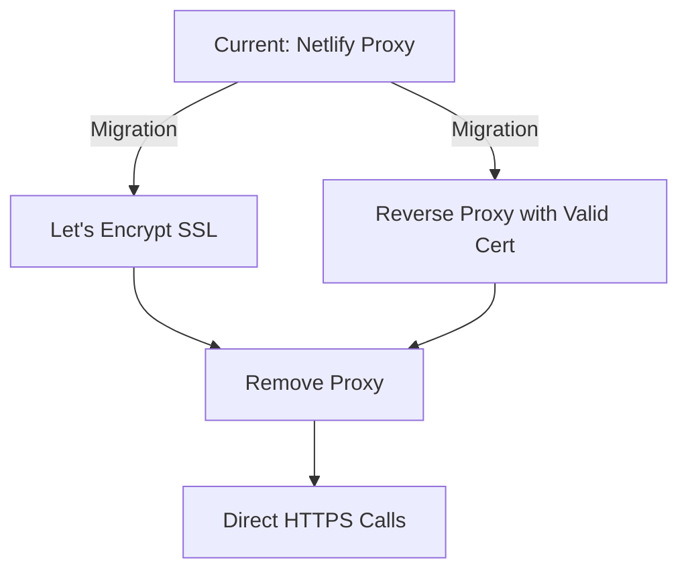

# Netlify Functions SSL Proxy - Implementation Guide

## Overview

This document describes the Netlify Functions-based proxy solution for handling n8n webhooks with self-signed SSL certificates.

## Problem Statement

Browsers cannot bypass SSL certificate verification for security reasons. When calling webhooks on `https://n8n.traidenis.lt:5678` with a self-signed certificate, the browser throws:

```
SSL certificate problem: self signed certificate
```

## Solution Architecture

```
┌─────────┐         ┌──────────────────┐         ┌─────────────┐
│ Browser │────────▶│ Netlify Function │────────▶│ n8n Webhook │
│         │  HTTPS  │   (n8n-proxy)    │  HTTPS  │ (self-signed)
│         │ ✓ Valid │                  │ ✗ Bypass│             │
└─────────┘  Cert   └──────────────────┘   SSL   └─────────────┘
```

1. **Browser → Netlify**: Uses your site's valid SSL certificate
2. **Netlify → n8n**: Server-side Node.js bypasses SSL verification using `NODE_TLS_REJECT_UNAUTHORIZED = '0'`
3. **Response flows back**: Data returns through the same path

## Files Structure

```
netlify/
└── functions/
    └── n8n-proxy.ts          # Serverless proxy function

src/
├── lib/
│   ├── webhooksService.ts    # callWebhookViaProxy() helper
│   ├── instructionsService.ts
│   └── vectorSearch.ts
└── components/
    ├── NestandardiniaiInterface.tsx
    └── CommercialOfferPanel.tsx
```

## Implementation Details

### 1. Netlify Function: `n8n-proxy.ts`

**Location**: `netlify/functions/n8n-proxy.ts`

**Endpoint**: `/.netlify/functions/n8n-proxy`

**Key Features**:
- Accepts POST requests with `{ webhookUrl, data }`
- Sets `process.env.NODE_TLS_REJECT_UNAUTHORIZED = '0'` to bypass SSL verification
- Uses `https.Agent` with `rejectUnauthorized: false`
- Returns standardized response: `{ success, status, data, error }`
- Handles CORS with `Access-Control-Allow-Origin: *`

**Request Format**:
```json
{
  "webhookUrl": "https://n8n.traidenis.lt:5678/webhook-test/...",
  "data": {
    "action": "just-upload",
    "filename": "example.eml",
    "fileContent": "base64string..."
  }
}
```

**Response Format**:
```json
{
  "success": true,
  "status": 200,
  "data": {
    "subjectLine": "...",
    "description": "..."
  }
}
```

### 2. Helper Function: `callWebhookViaProxy()`

**Location**: `src/lib/webhooksService.ts`

**Usage**:
```typescript
import { callWebhookViaProxy } from '../lib/webhooksService';

const result = await callWebhookViaProxy(
  'https://n8n.traidenis.lt:5678/webhook-test/abc123',
  {
    action: 'just-upload',
    filename: 'example.eml',
    fileContent: base64Content
  }
);

if (result.success) {
  console.log('Success:', result.data);
} else {
  console.error('Error:', result.error);
}
```

**Return Type**:
```typescript
{
  success: boolean;
  status: number;
  data?: any;
  error?: string;
}
```

### 3. Updated Files

#### `instructionsService.ts`
- `triggerWebhook()` function now uses `callWebhookViaProxy()`
- Handles instruction variable updates to n8n

#### `vectorSearch.ts`
- `searchDocumentsClient()` detects HTTPS webhooks (excluding ngrok)
- Uses proxy for self-signed HTTPS, direct fetch for HTTP/ngrok

#### `NestandardiniaiInterface.tsx`
Three webhook calls updated:
- `handleNewRequest()` - Upload new EML file
- `handleFindSimilar()` - Find similar products
- `handleUploadSolution()` - Upload commercial offer

#### `CommercialOfferPanel.tsx`
- `handleFillDoc()` - Generate commercial offer document

#### `webhooksService.ts`
- `testWebhook()` - Admin webhook testing now uses proxy for HTTPS

## Security Considerations

### ⚠️ Security Warning

**This solution disables SSL certificate verification**, which has security implications:

| Aspect | Risk Level | Details |
|--------|-----------|---------|
| Browser → Netlify | ✅ Secure | Uses valid SSL certificate |
| Netlify → n8n | ⚠️ Vulnerable | Bypasses SSL verification |
| Man-in-the-Middle | ⚠️ Possible | Attacker could intercept Netlify → n8n traffic |
| Data Integrity | ⚠️ At Risk | Response could be tampered with |

### When This Solution is Acceptable

✅ **Safe for:**
- Internal n8n instances on private networks
- Development and staging environments
- Self-signed certificates you control
- Temporary workaround while migrating to proper SSL

❌ **NOT safe for:**
- Production systems on public internet
- Handling sensitive user data over public networks
- Compliance-regulated environments (HIPAA, PCI-DSS, etc.)
- Long-term production deployments

### Recommended Production Path



1. **Short-term**: Use Netlify proxy (current implementation)
2. **Medium-term**: Get Let's Encrypt certificate for n8n
3. **Long-term**: Remove proxy, use direct HTTPS calls

## Deployment

### Automatic Deployment

The Netlify Function is automatically deployed when you push to your branch:

```bash
git push origin claude/netlify-ssl-bypass-sxexC
```

Netlify detects the `netlify/functions/` directory and deploys all functions automatically.

### Configuration

**netlify.toml**:
```toml
[build]
  functions = "netlify/functions"
  publish = "dist"

[functions]
  node_bundler = "esbuild"
```

No environment variables needed - the function is self-contained.

### Testing After Deployment

1. **Check deployment logs** in Netlify dashboard
2. **Test the function** directly:
```bash
curl -X POST https://your-site.netlify.app/.netlify/functions/n8n-proxy \
  -H "Content-Type: application/json" \
  -d '{
    "webhookUrl": "https://n8n.traidenis.lt:5678/webhook-test/...",
    "data": { "test": true }
  }'
```

3. **Test via UI**: Use the Webhooks admin panel to test each webhook

## Troubleshooting

### Function Returns 500 Error

**Possible Causes**:
- Webhook URL is invalid or unreachable
- n8n service is down
- Network connectivity issues

**Debug Steps**:
```bash
# Check Netlify function logs
netlify functions:log n8n-proxy

# Test n8n directly from server
curl -k https://n8n.traidenis.lt:5678/webhook-test/...
```

### Function Returns 400 Error

**Possible Causes**:
- Missing `webhookUrl` or `data` in request body
- Invalid JSON in request

**Fix**: Verify request format matches the schema

### CORS Errors

**Possible Causes**:
- Preflight OPTIONS request not handled
- Missing CORS headers

**Fix**: Function already handles CORS. If issues persist, check browser console for specific error.

### SSL Bypass Not Working

**Possible Causes**:
- `NODE_TLS_REJECT_UNAUTHORIZED` not set correctly
- Using wrong HTTPS agent

**Fix**: Verify the code sets both:
```typescript
process.env.NODE_TLS_REJECT_UNAUTHORIZED = '0';

const httpsAgent = new https.Agent({
  rejectUnauthorized: false,
});
```

## Performance Considerations

### Latency

Adding a proxy introduces additional latency:

```
Direct call:    Browser → n8n (1 hop)
Proxied call:   Browser → Netlify → n8n (2 hops)
```

**Expected overhead**: +50-200ms depending on Netlify function cold start

### Cold Starts

Netlify Functions have cold starts (~100-500ms) when not recently used.

**Mitigation**:
- Netlify keeps functions warm for ~5 minutes after use
- Consider Netlify Pro for faster cold starts if needed

### Rate Limits

Netlify Free tier limits:
- 125,000 function invocations/month
- 100 hours runtime/month

For this use case, this is usually sufficient.

## Monitoring

### Logging

The proxy logs key events:
```typescript
console.log(`[n8n-proxy] Forwarding request to: ${webhookUrl}`);
console.log(`[n8n-proxy] Response status: ${response.status}`);
```

View logs in Netlify Dashboard → Functions → n8n-proxy

### Error Tracking

Errors are logged with context:
```typescript
console.error('[n8n-proxy] Error:', error);
```

Consider adding error tracking (Sentry, LogRocket, etc.) for production.

## Future Improvements

### 1. Environment-Based SSL Verification

```typescript
// Only bypass SSL in development
const shouldBypassSSL = process.env.NODE_ENV !== 'production';

const httpsAgent = new https.Agent({
  rejectUnauthorized: !shouldBypassSSL,
});
```

### 2. Webhook URL Allowlist

```typescript
const ALLOWED_WEBHOOKS = [
  'n8n.traidenis.lt',
  'n8n-self-host-gedarta.onrender.com'
];

// Validate webhook URL is in allowlist
```

### 3. Request Signing

Add HMAC signatures to verify requests are legitimate:
```typescript
const signature = crypto
  .createHmac('sha256', SECRET_KEY)
  .update(JSON.stringify(data))
  .digest('hex');
```

### 4. Response Caching

Cache responses for idempotent requests:
```typescript
// Cache GET-like operations
if (data.action === 'get-something') {
  // Use Netlify Edge Functions caching
}
```

## Migration to Proper SSL

When ready to remove the proxy:

1. **Install Let's Encrypt on n8n server**:
```bash
sudo certbot certonly --standalone -d n8n.traidenis.lt
```

2. **Configure n8n with certificate**:
```bash
export N8N_PROTOCOL=https
export N8N_SSL_KEY=/etc/letsencrypt/live/n8n.traidenis.lt/privkey.pem
export N8N_SSL_CERT=/etc/letsencrypt/live/n8n.traidenis.lt/fullchain.pem
```

3. **Update code to direct calls**:
```typescript
// Replace
const result = await callWebhookViaProxy(url, data);

// With
const response = await fetch(url, {
  method: 'POST',
  headers: { 'Content-Type': 'application/json' },
  body: JSON.stringify(data)
});
```

4. **Remove proxy function** (optional cleanup):
```bash
rm netlify/functions/n8n-proxy.ts
```

## References

- [Netlify Functions Documentation](https://docs.netlify.com/functions/overview/)
- [Node.js HTTPS Agent Documentation](https://nodejs.org/api/https.html#https_class_https_agent)
- [Let's Encrypt Documentation](https://letsencrypt.org/docs/)
- [SSL Certificate Best Practices](https://www.ssl.com/guide/ssl-best-practices/)

## Support

If you encounter issues:

1. Check Netlify function logs
2. Review n8n webhook logs
3. Test with direct curl commands
4. Verify network connectivity
5. Check SSL_CERTIFICATE_SOLUTION.md for alternative solutions

---

**Last Updated**: 2026-01-23
**Implementation Status**: ✅ Complete and Deployed
